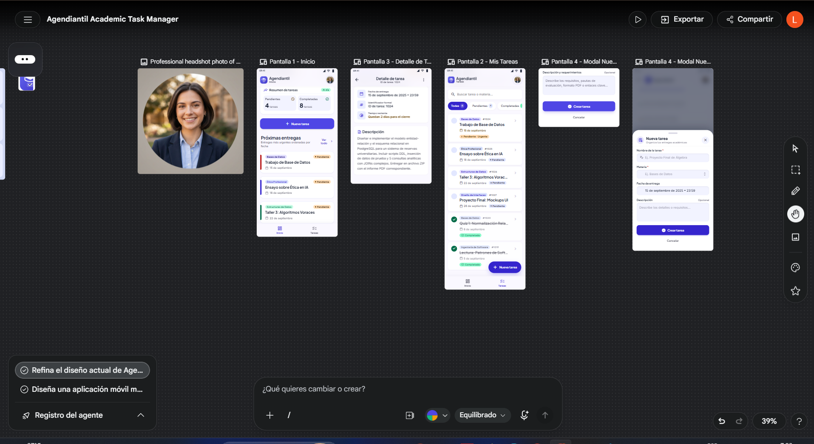

# Arquitectura de Agendiantil

## 1. Wireframe de Navegación

El wireframe de navegación diseñado en la Fase 1 representa las principales pantallas y conexiones de la aplicación móvil Agendiantil.



La aplicación cuenta con dos pestañas principales:

- **Inicio:** muestra el resumen de tareas y próximas entregas.
- **Tareas:** permite consultar y buscar las tareas registradas.

Desde estas pantallas se puede acceder a la creación de una nueva tarea mediante una pantalla modal y consultar el detalle de una tarea mediante una ruta dinámica.

---

## 2. Explicación del Flujo

La aplicación utiliza **Expo Router**, por lo que la navegación se organiza mediante archivos y carpetas dentro de `app/`.

La estructura principal de navegación es:

```text
app/
├── (tabs)/
│   ├── _layout.tsx
│   ├── index.tsx
│   └── tasks.tsx
├── task/
│   └── [id].tsx
├── modal.tsx
├── _layout.tsx
└── +not-found.tsx